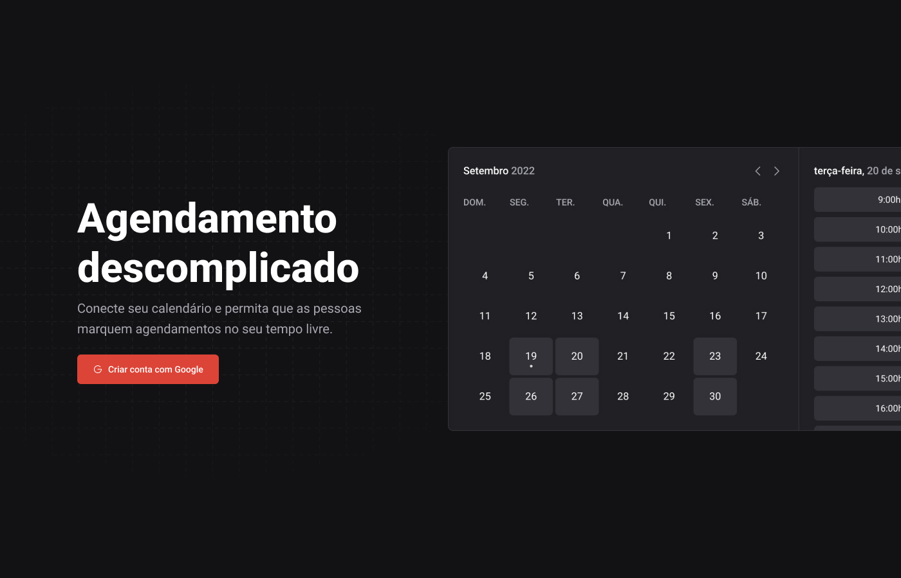

  

# Ignite Call

  
  
  

Ignite Call is an application that allows users to create a custom calendar with available dates and times for scheduling events, using Google OAuth2 and Google Calendar API integration.

Create your **custom calendar** URL and share with others to schedule events with you in a simple and easy way.

## 🚀 Features

1. **Google OAuth2 Integration:** Users can sign in using their Google account.

2. **Google Calendar API Integration:** Users can create a custom calendar with available dates and times for scheduling events.

3. **Custom Calendar Link**: Users can share their custom calendar link with others.

4. **Event Scheduling:** Users can schedule events with other users.

 

## 🛠️ Technologies

This application is built using the following technologies:

- [NextJS](https://nextjs.org/)
- [NextAuth.js](https://next-auth.js.org/)
- [React](https://reactjs.org/)
- [TypeScript](https://www.typescriptlang.org/)
- [Google OAuth2](https://developers.google.com/identity/protocols/oauth2)
- [Google Calendar API](https://developers.google.com/calendar)

 

## 🚀 Getting Started

Follow these steps to get started with the Application:

1. Clone the repository to your local machine.

2. Install dependencies using the command `npm install`.

3. Start the development server using the command `npm run dev`.

4. In your browser, navigate to `http://localhost:3000` to access the application.

 

## 🚀 Creating a Production Build

To create a production build of the Timer Application, follow these steps:

1. Run the command `npm run build`.

2. Run `npm start` to run `.next` build file

 

## 🤝 Contributing

Contributions to this project are welcome. To contribute, follow these steps:

1. Fork the repository.

2. Create a new branch.

3. Make your changes and commit them.

4. Push to the new branch.

5. Create a pull request.

 

## 📝 License

This project is licensed under the MIT License.